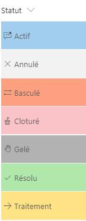

# Conditional formatting based on the value of a status column

## Summary
Here we applied conditional formatting to a choice fields that contain a fixed set of values. The following example applies different classes depending on whether the value of the field is:
  - Actif (Active), 
  - Annulé (Canceled),
  - Basculé (Toggled or Swtiched),
  - Clôturé (Closed),
  - Gelé (Frozen),
  - Résolu (Resolved),
  - Traitement (In progress), 

**PS: in my case, I was working on a French version (the words between brackets are the equivalent words in english)**

This example uses a CSS class (`sp-css-backgroundColor-XXXXX`) to the  `
` based on the field's value. This is what determines the element's background color. Then, it outputs a `` element with an `iconName` attribute. This attribute applies another CSS class to that `` that shows an [Office UI Fabric](https://dev.office.com/fabric#/) icon inside that element.

This pattern is useful when you want different values to map to different levels of severity, issue status, page status ...etc. 

## View requirements
- This format can be applied to choice column and expects the following values Done, In progress, In review, Has Issues, or anything else

## Sample

Solution|Author(s)
--------|---------
text-conditional-format.json | SharePoint Team

## Version history

Version|Date|Comments
-------|----|--------
1.0|November 2, 2017|Initial release
1.1|August 20, 2018|Switched to Excel-style expression, added theme fontColor, fixed issue with "Has Issues" status

## Disclaimer
**THIS CODE IS PROVIDED *AS IS* WITHOUT WARRANTY OF ANY KIND, EITHER EXPRESS OR IMPLIED, INCLUDING ANY IMPLIED WARRANTIES OF FITNESS FOR A PARTICULAR PURPOSE, MERCHANTABILITY, OR NON-INFRINGEMENT.**

---

## Additional notes
This sample is also covered in the main documentation around the Column Formatting

- [Use column formatting to customize SharePoint](https://docs.microsoft.com/en-us/sharepoint/dev/declarative-customization/column-formatting)

> An additional version using Abstract Tree Syntax (AST) is also provided for environments where the Excel-style expressions are not supported.

